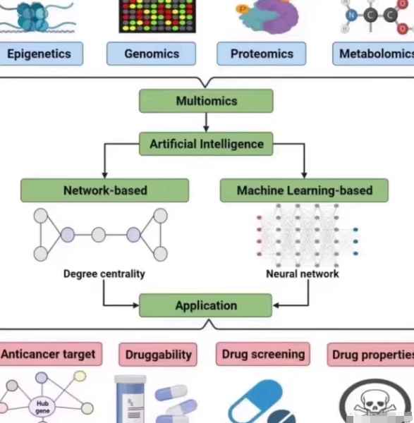
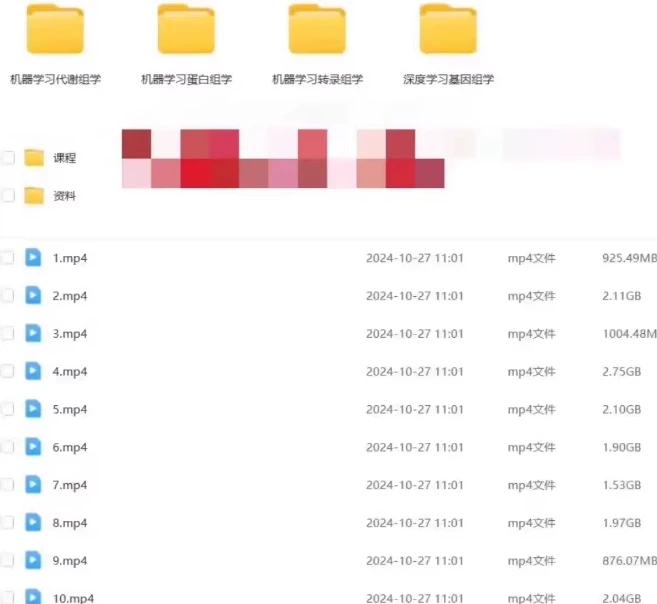
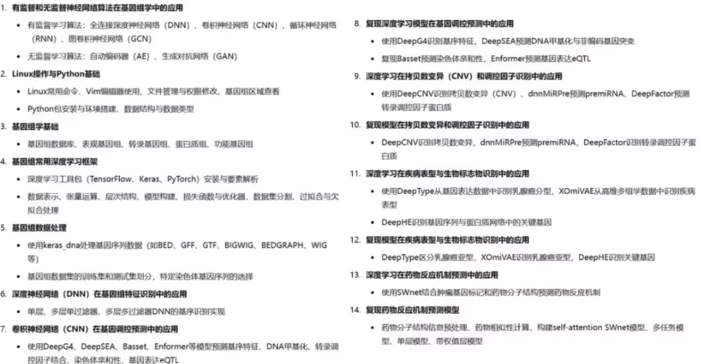
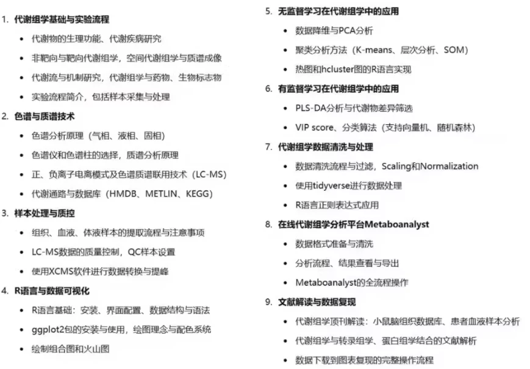
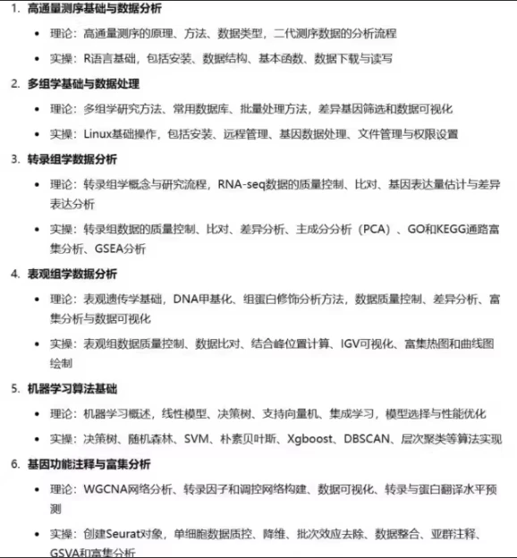

# 【Multi-omics and Machine Learning Course】The course covers the main omics research areas in bioinformatics.

## Body

【Multi-omics and Machine Learning Course】This course covers the main research methods in bioinformatics, systematically introducing the analysis of metabolomics, transcriptomics, proteomics, and genomics, as well as the application of machine learning. The content is summarized as follows:

Metabolomics: This section explains the physiological functions of metabolites, metabolic flow, and spatial metabolomics techniques. It combines chromatography and mass spectrometry (LC-MS) analysis, and uses R language and machine learning methods for data cleaning, differential analysis, enrichment analysis, and biomarker discovery.

Transcriptomics and Epigenomics: It covers high-throughput sequencing data analysis of transcriptomics and epigenetics, including RNA-seq data, differential gene screening, methylation, and histone modification analysis. It also applies machine learning for regulatory network construction, disease prediction, and phenotype analysis.

Proteomics: This section focuses on the application of machine learning in protein data, such as protein marker identification, disease classification, and prognosis prediction. It utilizes R language and zero-code tools for protein data processing, feature selection, model building, and visualization analysis.

Genomics: It covers the basics of genomics and multi-omics integration, introducing high-throughput sequencing data processing, variant detection, and annotation. It combines deep learning and machine learning methods to achieve disease gene screening, functional gene network construction, etc.

Comprehensive Machine Learning Skills: This section provides applications of machine learning in multi-omics data, including common models (such as decision trees, SVM, random forests, etc.), dimensionality reduction, clustering, classification, etc. It also integrates multi-omics databases and visualization tools to help learners master the entire process from data preprocessing to model validation.
The course combines theory and practical operations, covering multi-omics research methods from genome to metabolome, suitable for learners in bioinformatics, medicine, and related fields.

Virtual items cannot be returned after purchase!
Protein trial: 【Super Member V3】Share file: 1.mp4
Link: https://pan.baidu.com/s/1fVG1RAui6r4ya0eU5MusLQ?pwd=11d6
Extraction code: 11d6
Copy this link and open the "Baidu Cloud App" to get it.
(Disclaimer: This material is compiled from online data for communication only. The display does not represent the value of the content; it is merely a compilation of effort fees. If there is any infringement, please contact us to delete it.)

## Images

## Payment

Here is a pay link on Stripe ( https://buy.stripe.com/3cs8yP7sY87d0vu9AB ). Please contact me lonlonago@foxmail.com after funding $89, and I will send you a complete data files , thank you!

